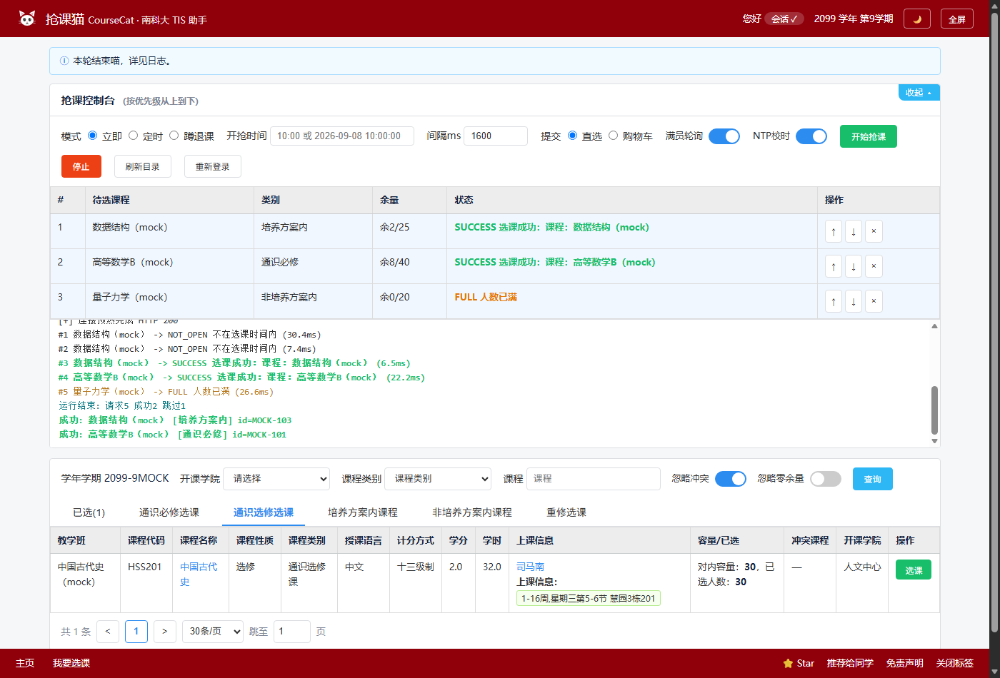
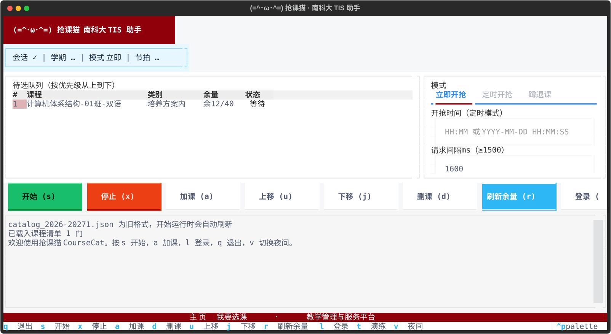

<!-- 发布前：全局替换 WilloTwisper/SUSTech-CourseCat 为你的仓库地址 -->
# (=^･ω･^=) 抢课猫 CourseCat

[English](./README_EN.md) | **中文**

[](https://www.python.org/)
[](./LICENSE)
[](https://tis.sustech.edu.cn)

南科大 TIS 选课助手：**串行、限速合规**，开箱即用。对
[SUSTech_Tools](https://github.com/GhostFrankWu/SUSTech_Tools) 与
[SUSTech-tis-cheater](https://github.com/vollate/SUSTech-tis-cheater) 的彻底重写：
上游因 2026 秋 TIS 接口变动而失效（见其 issue #36），本项目以可配置适配层 + Mock 演练 +
精确调度的思路重建，接口再变只需改配置，不用读代码。

> **觉得好用请右上角 ⭐ Star，并推荐给同学**（Web 版页脚可一键分享）。
> 仅供个人学习研究，使用本工具产生的任何行为由使用者本人承担，
> 请确保符合学校规章制度与相关法规（详见文末免责声明）。

## 界面预览

| Web 版（浏览器打开，与教务页同款样式） | TUI 版（终端全屏） |
| --- | --- |
|  |  |

> Web 图为内置 Mock 演练模式实拍（零外网请求）；真实数据界面布局完全一致。
> 右上角 🌙 可切换黑夜模式（`docs/screenshot-web-dark.png`）。

## 设计原则（与"提速"的关系）

学校的限制是硬约束：**用户级限频，请求间隔 ≥1500ms（2024-09 观测），每个有效请求都会
刷新限频窗口**。超过限频的并发/狂发只会被 429 拒绝，反而更慢。因此本项目把工程精力放在
"每个被允许的请求都尽量有效"上：

| 优化点 | 说明 |
| --- | --- |
| 严格串行 + 单连接 | `httpx` 单连接 keep-alive + HTTP/2，杜绝并发触发限频 |
| 精确节拍 | `perf_counter` 基准的欠步进调度器，间隔无累积漂移 |
| 429 自适应退避 | 命中限频自动倍增间隔（上限 16 倍），恢复基线避免持续浪费 |
| 定时开抢 | `--at HH:MM:SS`，可选 SNTP 校准时钟（`--use-ntp`），毫秒级在 T0 发出第一笔请求 |
| 预热 | 开抢前完成 TLS/HTTP2 握手与会话校验，T0 只做选课请求本身 |
| 预编码载荷 | 表单在启动时编码一次，热循环零序列化开销 |
| 严格优先级 | 高优先级课程未成功/未跳过前不动低优先级，失败原因落盘可复盘 |
| 结果分类 | 成功/已选/冲突/满员/未开放/限频/会话失效 分类驱动不同策略 |

**明确不做**：多线程/多账号/代理池、UA 伪造或流量特征伪装、绕过验证码、突破限频间隔。
本工具发送诚实 UA，请求行为与手动选课同量级。

## 安装（三选一）

**方式一：小白一键（推荐）**——下载本仓库 ZIP 解压后双击：

- `启动抢课猫-Web.bat` → 自动装环境并打开网页版
- `启动抢课猫-TUI.bat` → 终端全屏版

**方式二：从 GitHub 直接装：**

```powershell
pip install "git+https://github.com/WilloTwisper/SUSTech-CourseCat.git"
coursecat-web
```

**方式三：源码开发：**

```powershell
git clone https://github.com/WilloTwisper/SUSTech-CourseCat.git
cd SUSTech-CourseCat
python -m venv .venv
.venv\Scripts\python -m pip install -e ".[dev]"
```

可选：Windows 桌面通知 `pip install winotify`。

## 第一步：先演练（强烈建议）

内置 Mock TIS 服务器（MOCK-101 恒成功 / MOCK-102 恒冲突 / MOCK-103 第3次成功 /
MOCK-104 恒满员 / MOCK-105 前两次 429 后成功）：

```powershell
copy courses.example.txt courses.txt
.venv\Scripts\coursecat --rehearse --courses courses.txt --report report.json
```

零外网请求即可验证：登录态检测、优先级顺序、冲突/满员跳过、429 退避、报告输出全部工作正常。

## 一键用法（推荐）

**Web 版（和教务页面同款样式，推荐）：**

```powershell
.venv\Scripts\coursecat-web
```

自动打开 `http://127.0.0.1:8766/`（仅本机监听）：深红顶栏、分类 Tab（已选/通识必修/通识选修/培养方案内…）、
带课程代码/学分/学时/上课信息/容量已选的完整课表、绿色选课键——布局对标 TIS 选课页。
页面上方是抢课控制台：优先级队列（↑↓×调整）、模式（立即/定时/蹲退课）、
间隔、满员轮询、开始/停止、实时日志，成功时页面横幅 + 提示音。

```powershell
.venv\Scripts\coursecat-web --port 8766 --no-browser   # 自定义端口/不自动打开
```

**全屏 TUI（零参数，不用记任何命令，TIS 同款配色）：**

```powershell
.venv\Scripts\coursecat-tui
```

```
┏◉ 南方科技大学  教学管理与服务平台 · 抢课助手（深红顶栏）┓
┃ 会话 ✓ │ 学期 2026-2027秋 │ 模式 立即（浅蓝信息条）    ┃
┃ 待选队列（灰表头+斑马纹） │ 立即开抢|定时开抢|蹲退课（蓝下划线Tab）┃
┃ 1 计算机体系结构 … 余8     │ 开抢时间 [10:00:00]        ┃
┃ 2 …                       │ 提交目标：直接进已选|进购物车┃
┃ [开始·绿][停止][加课][删][刷新·蓝][登录]               ┃
┃ 日志区（实时请求流）                                  ┃
┗ 主页   |   我要选课（深红底栏） ━━━━━━━━━━━━━━━━━━━━━━┛
   s开始 x停止 a加课 d删课 u/j移位 r余量 l登录 t演练
```

- `a` 弹出搜索框：输关键字实时过滤余量，Enter 加入，Esc 返回
- 参数全是点选/填空，队列支持上移下移调优先级，结果自动同步回 `courses.txt`（和 CLI 互通）
- 状态栏实时显示会话/学期/模式/当前节拍（含 429 退避后的拉长值）
- 鼠标全可用（需 Windows Terminal 等支持鼠标的终端）：点按钮/点表格行/点输入框聚焦；
  加课弹窗里**单击课程直接加入**，**点弹窗外面关闭**

**命令行向导：**

```powershell
.venv\Scripts\coursecat
```

**裸命令 = 一键向导**：没有 Cookie 就自动拉起浏览器登录（隔离临时配置，捕获后即删）；
没有课程清单就进入交互选课器；最后选模式（立即/定时/蹲退课/演练）直接开跑。

分步命令：

| 命令 | 作用 |
| --- | --- |
| `coursecat --login` | 拉起 Edge/Chrome 自动登录，捕获 TIS 会话存入 `cookies.txt`（支持验证码/二次验证，因为是真实浏览器） |
| `coursecat --pick` | 交互选课器：关键字搜索 + 实时余量（余N/容量），按序号排优先级，自动写 `courses.txt` |
| `coursecat` | 向导模式，把上面所有步骤串起来 |

智能默认：访问 `*.sustech.edu.cn` 自动直连（忽略系统代理，不再需要 `--no-env-proxy`）；
会话失效时自动提示一键重登。

交互细节（现代 TUI，`rich` + `prompt_toolkit`，缺失时自动回退纯文本）：

- 选课器边打字边出候选（含余量），方向键选择、Enter 加入，底栏实时显示当前队列
- 定时开抢有实时倒计时面板；T0 前 3s 切换高精度等待
- 选课成功弹绿色面板 + 蜂鸣 +（可选）桌面通知/webhook
- **Ctrl+C 语义**：选课中第一下=优雅停止（完成当前节拍、输出汇总），汇总打印阶段再按=强制退出；
  向导/定时等待中按=取消，**绝不会误触发开抢**

## 实战流程

### 1. 导入登录态（三选一）

| 方式 | 命令 | 说明 |
| --- | --- | --- |
| Cookie 文件（推荐） | `--cookies cookies.txt` | 支持三种格式：Netscape cookies.txt、Chrome/Fiddler 导出的 `.har`、或直接粘贴的原始 `Cookie:` 头 |
| 内联 | `--cookie JSESSIONID=xxx --cookie route=yyy` | 可重复 |
| CAS 账号（实验性） | `--cas-login` | 运行时输入密码，仅存内存，不落盘；遇验证码/CAS 变更会明确报错并引导走浏览器路径 |

> Cookie 获取：浏览器登录 TIS → F12 → Network → 任意 XHR 请求 → 复制请求头里的
> `Cookie:` 整行，存成 `cookies.txt`（首行 `Cookie: ...` 即可被识别）。
> TIS 改用单 Cookie（如 `SESSION`）时同样适用，无需硬编码。

### 2. 查询课程精确名称并写入 courses.txt

```powershell
.venv\Scripts\coursecat --cookies cookies.txt --list 数据结构
# 把想要的“任务名”按优先级写入 courses.txt，每行一个
```

### 3a. 即时开抢

```powershell
.venv\Scripts\coursecat --cookies cookies.txt --courses courses.txt --interval-ms 1600
```

运行中交互（前台 TTY）：回车或 `s` = 跳过当前课程；`q` = 停止。Ctrl+C 同样安全停止。

### 3b. 定时开抢（选课系统放开的瞬间）

```powershell
.venv\Scripts\coursecat --cookies cookies.txt --courses courses.txt --at 10:00:00 --use-ntp
```

- `--use-ntp` 用 SNTP 校准本机时钟（UDP/123），打印偏差毫秒数
- T0 前 2s 做二次预热，T0 精确发出第一笔选课请求
- 若 T0 时返回"未开放"，之后按节拍继续重试，第一时间命中放开窗口

### 4. 常用变体

| 目标 | 参数 |
| --- | --- |
| 满员课蹲退课 | `--retry-full`（FULL 不跳过，持续按节拍重试） |
| 蹲退课同时抢后备 | `--retry-full --cascade`（满员课转队尾轮询，不饿死后备课程） |
| 冲突课人工确认 | `--no-auto-skip` |
| 只提交购物车 | `--submit-target rwtjzgwc` |
| 跨天定时 | `--at "2026-09-08 10:00:00"`（也支持 `--at 10:00` 当天） |
| 学期初证书异常 | `--tls-no-verify`（仅应急） |
| 成功推送 | `--webhook https://...`（POST `{"content": ...}`，Discord/Bark/企业微信兼容） |

### 5. 抢课日战术（先到先得 / 定时批量释放）

- 表上“余X”是目录快照，抢课时段几秒就变；**唯一真理是服务端每次返回的裁决**，
  FULL 时若快照还有余量，日志会额外打印配额快照供复盘
- 退课名额若按固定时刻批量释放（如每天 13:00），提前 2 秒进场、让请求流 cross 过释放点：

```powershell
.venv\Scripts\coursecat --cookies cookies.txt --courses courses.txt `
  --at "2026-09-09 12:59:58" --use-ntp --retry-full --cascade --report report.json
```

- `--use-ntp` 校准时钟是关键：早/晚 1 秒都可能错过整批释放
- 当天已满且无释放窗口时，`--retry-full` 蹲守意义不大（退课要等下一释放点），省电关机

### 运维

- 每次运行自动落盘 `logs/run_YYYYmmdd_HHMMSS.log`（逐请求明细）；
  `--report report.json` 附完整 attempt 记录（课程/状态/报文/延迟/时间戳），可复盘
- 选课器输入 `r` 可刷新当前列表的实时余量（单类别查询，带限频保护）
- 目录缓存超过 12 小时会提示刷新（余量快照会过期）
- 长时间蹲退课中会话失效：自动提示“浏览器重登并继续”（最多 3 次），剩余队列不断档

## TIS 再改版怎么应对（针对 issue #36 类问题）

1. 浏览器登录 → F12 → Network，重放一次选课点击
2. 对照 `[endpoints]`：路径变了改 `config.toml`；表单字段变了改
   `src/enroll_helper/tis/client.py::build_enroll_body`
3. 响应字段变了（`jg`/`message`）改 `[keywords]` 与 `parser.classify`
4. 跑 `--rehearse` 确认全流程，再上生产

学期信息缺失、返回非 JSON 等变更会以明确中文报错指出（而不是闪退），并提示检查点。

## 项目结构

```
src/enroll_helper/
├── cli.py            # 命令行编排：会话→学期→目录→队列→(定时)→引擎→报告
├── config.py         # TOML/JSON 配置 + CLI 覆盖 + 限频下限强制
├── engine.py         # 串行选课引擎：严格优先级/状态机/交互跳过/统计
├── pacer.py          # 无漂移节拍器 + 429 惩罚/恢复
├── clocksync.py      # SNTP 校准 + 精确等待
├── session.py        # Cookie 导入（Netscape/HAR/原始头）+ httpx 客户端工厂
├── cas.py            # 实验性 CAS 登录（内存凭据，不落盘）
├── login.py          # 一键登录：拉起真实浏览器，经 CDP 自动捕获会话
├── picker.py         # 交互选课器：搜索/余量/优先级队列
├── schedule.py       # 上课时间解析 + 冲突检测（单双周/周几/节次）
├── tis/              # 适配层：endpoints/models/parser/client
├── tui.py            # 终端输出层（rich/prompt_toolkit，自动回退纯文本）
├── tui_app.py        # 全屏 TUI（textual）：队列/参数/日志/加课弹窗
├── webserver.py      # Web 后端（标准库）：REST + 事件流
├── web/              # Web 前端：复刻 TIS 选课页的单页应用
├── notify.py         # 铃声/Windows 通知/webhook/JSON 报告
└── mockserver.py     # Mock TIS（演练 + 测试双用）
tests/                # 63 项单元与集成测试（pytest）
```

## 常见问题

| 现象 | 原因 / 解法 |
| --- | --- |
| `查询请求频率过高` / `jg=-1` | 查询接口的独立限频（比选课更严）。工具会自动退避重试；人多时多等一会儿，**不要**开多实例狂刷 |
| `会话疑似失效` / 返回登录页 | SESSION 过期：`coursecat --login` 或 Web 版点“重新登录” |
| 目录为空 / 课程搜不到 | 先点“刷新目录”（首次约半分钟）；确认学期正确 |
| 开了系统代理/TUN 连不上 | 访问 `*.sustech.edu.cn` 默认直连；TUN 是网卡层拦截，需在代理工具里把该域名加直连规则 |
| `冲突课程` 列有红字 | 该课与你的已选课时间冲突；打开 Web 版「忽略冲突」可直接隐藏这类课（提交时也会跳过） |
| 怀疑 TIS 又改版了 | 先跑 `--doctor` 看契约检查，再按“再改版应对”一节核对 |

## 免责声明

仅供个人学习与研究。使用本工具产生的任何行为由使用者本人承担，请确保符合学校规章制度
与相关法规。本工具不规避任何安全机制、不承诺任何效果，作者不对封号等后果负责。
选择策略与请求节奏已尽量对齐"人工选课"的量级，请勿修改代码以超越限频——那既违反规则，
实测也更慢。
